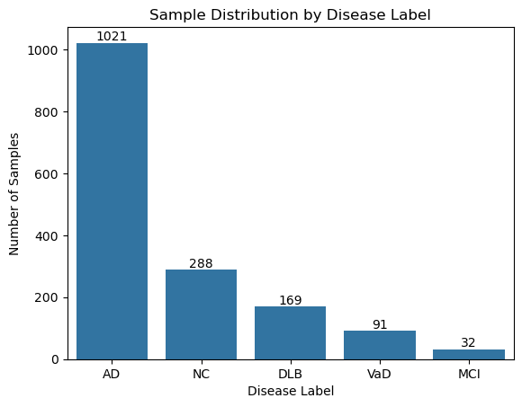
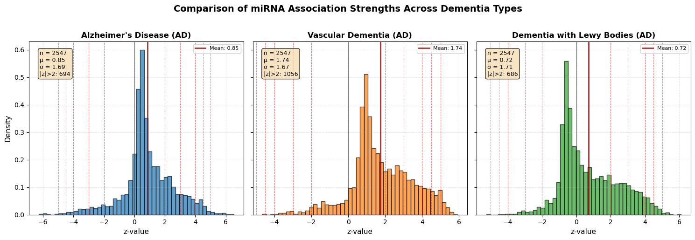
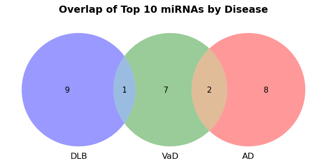
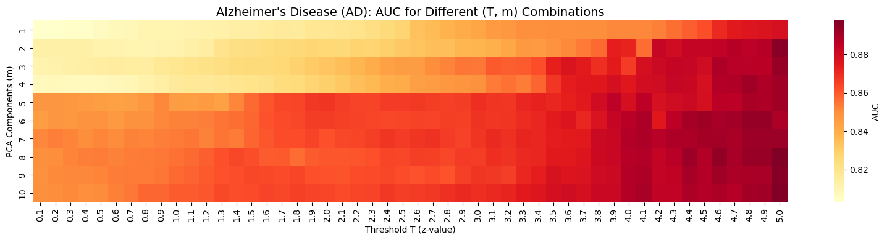
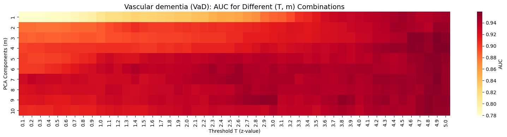
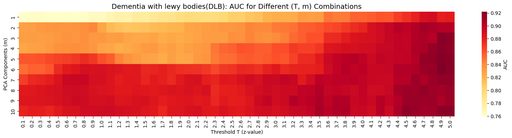
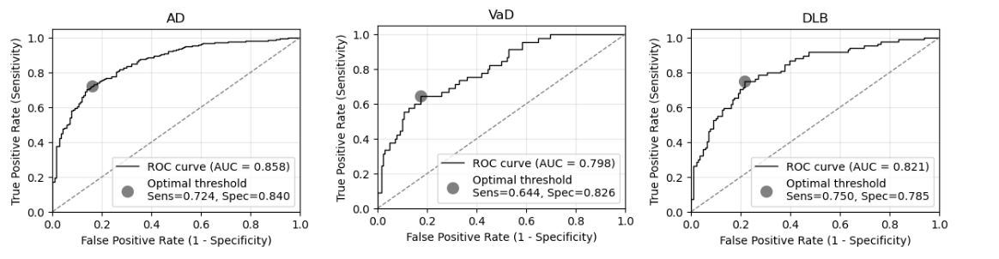

# Dementia Risk Prediction (miRNA data) API

Machine learning system for predicting dementia risk using serum miRNA biomarkers. A Python implementation of the supervised principal component analysis (PCA) methodology for dementia risk prediction from serum miRNA expression data.

## Features

- **End-to-end ML Pipeline**: From raw data to production predictions
- **Scalable Architecture**: Modular design with clear separation of concerns
- **Production APIs**: REST API for real-time predictions
- **Containerized**: Docker support for easy deployment
- **Notebooks**: Detailed analysis on jupyter notebooks
  

*Note: This is an independent reimplementation of the methods described in the referenced paper, created for educational purposes. All original research credit belongs to  [Shigemizu et al.](https://pubmed.ncbi.nlm.nih.gov/30820472/) [1]*
  

 ### Dataset

The dataset used in this study is sourced from the Gene Expression Omnibus (GEO) download [GEO Accession viewer](https://www.ncbi.nlm.nih.gov/geo/query/acc.cgi?acc=GSE120584). (GEO accession number: GSE120584)

The dataset contains 1601 samples for various neurodegenerative diseases:

| Disease Case | Sample Size |
|--------------|-------------|
| Alzheimer’s disease (AD) | 1,021 |
| Vascular dementia (VaD) | 91 |
| Dementia with lewy bodies (DLB) | 169 |
| Mild cognitive impairment (MCI) | 32 |
| Normal control (NC) | 288 |

### Split into Discovery and Validation cohorts

- Total samples: 1,601 (1021 AD + 91 VaD + 169 DLB + 32 MCI + 288 NC = 1,601)

As described in [1], we split the dataset into Discovery cohort and Validation Cohort

- Discovery cohort: 786 individuals (511 AD + 46 VaD + 85 DLB + 144 NC
- Validation cohort: 783 individuals (510 AD + 45 VaD + 84 DLB + 144 NC 

#### Discovery Cohort: Average Age, Sex, and APOE Information

| Phenotype | #Sample | Sex (M/F)| Average Age (std)  | Average APOEa (std) |
|:---|:---|:---|:---|:---|
| AD | 511 | 142/369  | 78.76 (+- 6.06) | 0.52 (+- 0.62)|
| DLB | 85 | 37/48  | 79.01 (+- 5.84) | 0.36 (+- 0.51)|
| NC | 144 | 72/72 | 73.17 (+- 6.37) | 0.22 (+- 0.45)|
| VaD | 46 | 17/29  | 79.02 (+- 6.27) | 0.20 (+- 0.40)|

#### Validation Cohort: Average Age, Sex, and APOE Information 

| Phenotype | #Sample | Sex (M/F) | Average Age (std)  | Average APOEa (std) |
|:---|:---|:---|:---|:---|
| AD | 510 | 165/345 | 79.73 (+- 6.21) | 0.47 (+- 0.62)|
| DLB | 84 | 31/53 | 80.04 (+- 6.22) | 0.30 (+- 0.50)|
| NC | 144 | 65/79 | 70.29 (+- 5.97) | 0.15 (+- 0.40)|
| VaD | 45 | 20/25 | 79.13 (+- 6.43) | 0.18 (+- 0.51)|

#### Binary Datasets
For both Discovery and Validation Cohort. The binary datasets were created for each disease label. 
- AD vs NC
- VaD vs NC
- DLB vs NC

### Biomarker Selection ( based on z-score)

We calculated z-scores for each of the 2,547 miRNAs in the discovery cohort using univariate logistic regression adjusted for clinical covariates (age, sex, and APOE-ε4 status). The z-score represents the strength of association between miRNA expression and AD diagnosis, with positive values indicating upregulation in AD patients and negative values indicating downregulation.  These z-scores serve as the foundation for the supervised principal component analysis, where miRNAs are filtered based on significance thresholds before dimensionality reduction. 

Overlap in top 10 miRNAs from z-score analysis

###  Supervised PCA Modeling

- Implemented two-step algorithm:

    - Filter miRNAs by z-score threshold (T)
    - Apply PCA dimensionality reduction (m components)

- Grid search over T (0.1-5.0) and m (1-10) using 10-fold cross-validation

- Selected optimal (T, m) combinations for each disease.

### Model Building & Validation

Then, we trained final logistic regression models on discovery cohort for each disease and then tested on independent validation cohort.

##### Accuracy estimation in three diseases using the validation cohort

| Disease | PI Cutoff | Accuracy | Sensitivity | Specificity |
|---------|-----------|----------|-------------|-------------|
| **AD**  | 0.640     | 0.708    | 0.661       | 0.875       |
| **VaD** | 0.160     | 0.751    | 0.644       | 0.785       |
| **DLB** | 0.165     | 0.759    | 0.476       | 0.924       |
 

## REFERENCES

[1] Shigemizu D, Akiyama S, Asanomi Y, Boroevich KA, Sharma A, Tsunoda T, Matsukuma K, Ichikawa M, Sudo H, Takizawa S, Sakurai T, Ozaki K, Ochiya T, Niida S. Risk prediction models for dementia constructed by supervised principal component analysis using miRNA expression data. Commun Biol. 2019 Feb 25;2:77. doi: 10.1038/s42003-019-0324-7. PMID: 30820472; PMCID: PMC6389908.

 [2] Li, Z., Guo, W., Ding, S., Chen, L., Feng, K., Huang, T. and Cai, Y.D., 2022. Identifying key MicroRNA signatures for neurodegenerative diseases with machine learning methods. Frontiers in Genetics, 13, p.880997.

 [3] Kursa M., Rudnicki W., "Feature Selection with the Boruta Package" Journal of Statistical Software, Vol. 36, Issue 11, Sep 2010 

 [4] [Risk prediction models for dementia constructed by supervised principal component analysis using miRNA expression data](https://www.ncbi.nlm.nih.gov/geo/query/acc.cgi?acc=GSE120584)

 [5] [A Guide to NCBI: Gene Expression](https://www.ncbi.nlm.nih.gov/home/tutorials/)